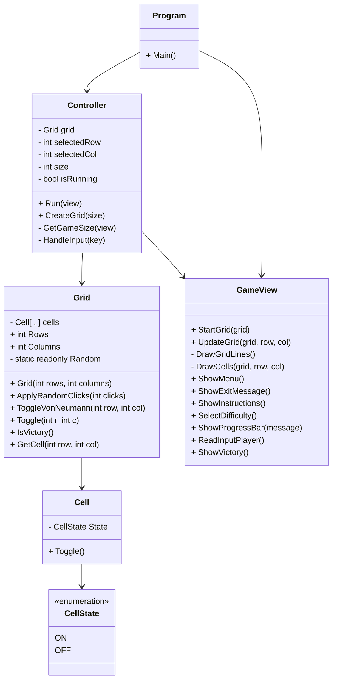

# Blackout

Projeto desenvolvido no âmbito da unidade curricular de LP1 (Linguagens de Programação I).

---

# Autores e Divisão de tarefas

## Margarida Teles, a22204247
- Implementação
  - Desenvolvimento do Controller
  - Desenvolvimento da Grelha
    - Implementação da grelha com diferentes tamanhos
    - Definição dos diferentes estados das células
  - Auxílio no desenvolvimento da GameView (View)
    - Atualizou o visual dos Menus
  - Comentários XML:
    - Documentação do código com comentários XML
- Relatório:
    - Desenvolvimento da secção **"Como jogar"**
      - Descrição de como se joga
    - Auxílio nas outras secções
    - Diagrama UML

## Miguel Rodrigues, a22208721
- Implementação
  - Desenvolvimento da GameView (View)
    - Menus (Principal e Dificuldade)
    - Mensagem de instrução
    - Painel ao sair do jogo
    - Visualização da Grelha (Todas as células)
  - Auxílio no desenvolvimento do Controller
  - Comentários XML:
    - Auxílio na documentação do código com comentários XML
- Relatório:
  - Desenvolvimento de todas as secções
  - Organização
  - Inclusão de capturas de ecrã

---

# Repositório Git

GitHub: https://github.com/MargaridaTeles/Blackout.git

---

# Descrição do Projeto

Blackout é um jogo de puzzle jogado numa grelha de células. Cada célula tem dois estados (ON ou OFF).

Quando o jogador seleciona uma célula:
- O estado da célula é invertido (ON para OFF e OFF para ON);
- O estado das células adjacentes (cima, baixo, esquerda e direita) também é invertido.

O objetivo do jogo é desligar todas as células da grelha.

O jogo inclui diferentes níveis de dificuldade, pelos quais o jogador pode optar:
- 3x3 (Fácil)
- 5x5 (Médio)
- 8x8 (Dificil)

---

# Como jogar
1 - O jogador inicia o programa.
>dotnet run --project Blackout

2 - Ao iniciar o programa aparece o Menu inicial que o permite inicial o jogo ou sair.

3 - Caso escolha "Start New Game", aparece outro menu que o permite selecionar a dificuldade desejada.

4 - A grelha é gerada com um padrão aleatório, após escolher a dificuldade.

5 - O jogador navega pela grelha (representada a vermelho a célula onde se encontra)

6 - Pressiona *Enter* ou *Space* para inverter o estado da célula selecionada e as adjacentes.

7 - O jogo termina quando desligar todas as células

*PS: Todas as opções e escolhas são feitas através do Input do teclado*

---
# Arquitetura da Solução

O projeto foi desenvolvido seguindo a abordagem MVC (Model-View-Controller), no qual:

## Model (Grid.cs / Cell.cs / CellState.cs)
Responsável pelos dados e pela lógica do jogo:
- Estado da grelha
- Regras do jogo
- Verificação de vitória
- Manipulação das células

## View (GameView.cs)
Responsável pela interface e por comunicar ao Controller as ações do utilizador:
- Apresentação da grelha (respetivas células)
- Menus:
  - Inicial
  - Dificuldade
- Instruções do jogo
- Mensagens de feedback de Vitória e de Saída

A interface é desenvolvida utilizando a biblioteca Spectre.Console.

## Controller (Controller.cs)
Contém o ciclo principal do jogo e controla o jogo baseado no input do utilizador, notifica a view para atualizar o que está a mostrar:
- Receção de input do jogador
- Atualização do estado do jogo
- Gestão do fluxo do jogo

---

# Algoritmos Utilizados

## Inicialização da Grelha

A grelha começa com todas as células desligadas.

Depois disso, são realizados vários cliques aleatórios na grelha, dependendo da dificuldade escolhida (3 para a fácil, 5 para a média e 8 para a dificil), para gerar o estado inicial do puzzle.

## Atualização das Células

Quando o jogador seleciona uma célula:
1. A célula selecionada muda de estado;
2. As células adjacentes também mudam de estado (cima, esquerda, direita e baixo);
3. O jogo verifica se todas as células estão desligadas.

## Verificação de Vitória

O jogo percorre todas as células da grelha para verificar se existem células ligadas.

Caso todas estejam desligadas, o jogador vence.

---

# Diagrama UML

---

# Bibliotecas Utilizadas

## Bibliotecas
- Spectre.Console
- .NET 10

## Ferramentas
- Git
- GitHub
- Visual Studio

---

# Referências

- Spectre.Console Documentation  
  https://spectreconsole.net/

---

# Utilização de IA

Foi utilizada IA generativa (ChatGPT) para:
- Esclarecimento de dúvidas;
- Apoio na organização do README;
- Apoio na documentação XML.

Toda a lógica e arquitetura do projeto foram desenvolvidas e compreendidas pelos elementos do grupo.