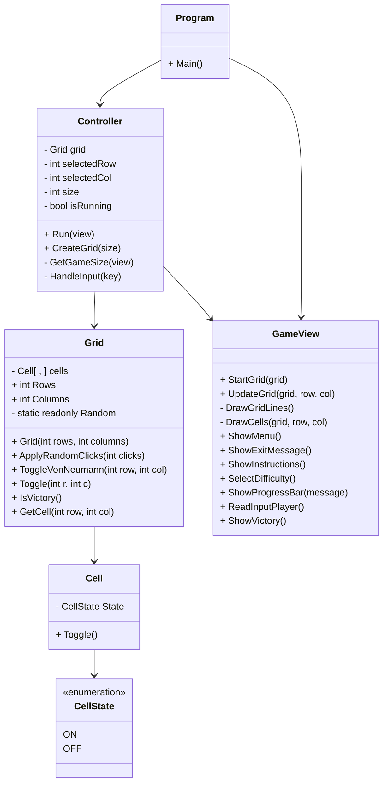

# Blackout

Projeto desenvolvido no âmbito da unidade curricular de **LP1 - Linguagens de Programação I**.

---

# Autores e Divisão de Tarefas

## Margarida Teles, a22204247
- Implementação
  - Desenvolvimento do Controller
  - Desenvolvimento da Grelha
    - Implementação da grelha com diferentes tamanhos
    - Definição dos diferentes estados das células
  - Auxílio no desenvolvimento da GameView (View)
    - Atualizou o visual dos Menus
  - Comentários XML:
    - Documentação do código com comentários XML
- Relatório:
    - Desenvolvimento da secção **"Como jogar"**
      - Descrição de como se joga
    - Auxílio nas outras secções
    - Diagrama UML

## Miguel Rodrigues, a22208721
- Implementação
  - Desenvolvimento da GameView (View)
    - Menus (Principal e Dificuldade)
    - Mensagem de instrução
    - Painel ao sair do jogo
    - Visualização da Grelha (Todas as células)
  - Auxílio no desenvolvimento do Controller
  - Comentários XML:
    - Auxílio na documentação do código com comentários XML
- Relatório:
  - Desenvolvimento de todas as secções
  - Organização
  - Inclusão de capturas de ecrã

---

# Repositório Git

GitHub: https://github.com/MargaridaTeles/Blackout.git

---

# Descrição do Projeto

**Blackout** é um jogo de puzzle jogado numa grelha de células, onde cada célula pode estar em dois estados: **ON** ou **OFF**.

Quando o jogador seleciona uma célula:
- A célula muda de estado;
- As células adjacentes (cima, baixo, esquerda e direita) também mudam de estado.

O objetivo é **desligar todas as células da grelha**.

O jogo disponibiliza três níveis de dificuldade:
- 3x3 - Fácil
- 5x5 - Médio
- 8x8 - Dificil

---

# Como jogar
1. Iniciar o programa. ```dotnet run --project Blackout```

2. Ao iniciar o programa surge o **Menu inicial** que o permite iniciar um novo jogo ou sair.


3. Caso escolha *Start New Game*, aparece outro menu que o permite escolher a dificuldade.


4. A grelha é gerada com um padrão aleatório, após escolher a dificuldade.


5. O jogador navega pela grelha (a célula selecionada aparece a vermelho).


6 - Pressiona **Enter** ou **Space** para inverter o estado da célula selecionada e as adjacentes.

7 - O jogo termina quando desligar todas as células, ou seja o estado **OFF**.


*Notas: Todas as ações são realizadas através do teclado.*

---
# Arquitetura da Solução

O projeto foi desenvolvido seguindo a abordagem **MVC (Model-View-Controller)**, no qual:

## Model
Ficheiros: Grid.cs, Cell.cs, CellState.cs

Responsável por:
- Estado interno da grelha
- Regras do jogo
- Manipulação das células
- Verificação de vitória

## View
Ficheiro: GameView.cs

Responsável por:
- Renderização da grelha
- Menus:
  - Inicial
  - Dificuldade
- Instruções do jogo
- Mensagens de feedback de Vitória e de Saída

A interface é desenvolvida utilizando a biblioteca **Spectre.Console**.

## Controller
Ficheiro: Controller.cs

Responsável por:
- Ciclo principal do jogo
- Receção de input do jogador
- Atualização do estado do jogo
- Comunicação entre Model e View

---

# Algoritmos Utilizados

## 1. Inicialização da Grelha

A grelha começa com todas as células desligadas (OFF) e com o tamanho da dificuldade selecionada.

Depois disso, são realizados x cliques aleatórios na grelha para gerar o puzzle, onde:
- x = 3 -> Fácil
- x = 5 -> Médio
- x = 8 -> Difícil

Cada clique aleatório usa o mesmo algoritmo de inversão do estado das células que o jogador usa, garantindo assim que o puzzle é possivel de resolver.

## 2. Algoritmo de Inversão (Toggle Von Neumman)

Quando o jogador seleciona uma célula, o jogo usa a vizinhança de **Von Neumann**, invertendo:
- A célula selecionada
- A célula acima
- A célula abaixo
- A célula à esquerda
- A célula à direita

O algoritmo também verifica sempre se as coordenadas são válidas para evitar que o jogador acesse fora da grelha.

## 3. Alternância de uma Célula
Cada célula possui um estado (**ON** ou **OFF**).
O método ```Toggle()``` simplesmente inverte o estado atual da célula selecionada e das vizinhas.

## 4. Verificação de Vitória

Após cada jogada, o jogo percorre todas as células da grelha para verificar se todas as células estão desligadas.

Caso todas estejam desligadas, o jogador vence.

## 5. Navegação na Grelha
O jogador navega entre as células através do teclado.

O Controller atualiza:
- ```selectedRow```
- ```selectedCol```

Garantindo que estes nunca ultrapassem os limites da grelha.
Todas as grelhas, independentemente do seu tamanho utilizam a mesma lógica.

---

# Diagrama UML



---

# Bibliotecas Utilizadas

## Bibliotecas
- Spectre.Console
- .NET 10

## Ferramentas
- Git
- GitHub
- Visual Studio

---

# Referências

- Spectre.Console Documentation  
  https://spectreconsole.net/

---

# Utilização de IA

Foi utilizada IA generativa (ChatGPT) para:
- Esclarecimento de dúvidas;
- Apoio na organização do README;
- Apoio na documentação XML.

Toda a lógica e arquitetura do projeto foram desenvolvidas e compreendidas pelos elementos do grupo.