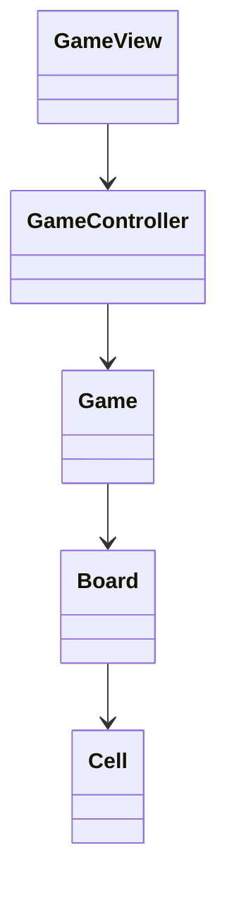

# Blackout

Projeto desenvolvido no âmbito da unidade curricular de LP1 (Linguagens de Programação I).

---

# Autores

## Margarida Teles
- Desenvolvimento do Game Loop
- Implementação da lógica principal do jogo

## Miguel Rodrigues
- Desenvolvimento da Game View
- Criação do README

---

# Repositório Git

GitHub: https://github.com/MargaridaTeles/Blackout.git

---

# Descrição do Projeto

Blackout é um jogo de puzzle jogado numa grelha de células. Cada célula pode estar ligada ou desligada.

Quando o jogador seleciona uma célula:
- O estado da célula é invertido;
- O estado das células adjacentes (cima, baixo, esquerda e direita) também é invertido.

O objetivo do jogo é desligar todas as células da grelha.

O jogo inclui diferentes níveis de dificuldade:
- 3x3
- 5x5
- 8x8

---

# Arquitetura da Solução

O projeto foi desenvolvido segundo o padrão MVC (Model-View-Controller).

## Model
Responsável pelos dados e pela lógica do jogo:
- Estado da grelha
- Regras do jogo
- Verificação de vitória
- Manipulação das células

## View
Responsável pela interface com o utilizador:
- Apresentação da grelha
- Menus
- Informação do jogo

A interface é desenvolvida utilizando a biblioteca Spectre.Console.

## Controller
Responsável pela comunicação entre a View e o Model:
- Receção de input do jogador
- Atualização do estado do jogo
- Gestão do fluxo do jogo

---

# Algoritmos Utilizados

## Inicialização da Grelha

A grelha começa com todas as células desligadas.

Depois disso, são realizados vários cliques aleatórios na grelha, dependendo da dificuldade escolhida, para gerar o estado inicial do puzzle.

## Atualização das Células

Quando o jogador seleciona uma posição:
1. A célula selecionada muda de estado;
2. As células adjacentes também mudam de estado;
3. O jogo verifica se todas as células estão desligadas.

## Verificação de Vitória

O jogo percorre todas as células da grelha para verificar se existem células ligadas.

Caso todas estejam desligadas, o jogador vence.

---

# Diagrama UML

---

# Bibliotecas Utilizadas

## Bibliotecas
- Spectre.Console
- .NET 10

## Ferramentas
- Git
- GitHub
- Visual Studio

---

# Referências

- Spectre.Console Documentation  
  https://spectreconsole.net/

---

# Utilização de IA

Foi utilizada IA generativa (ChatGPT) para:
- Esclarecimento de dúvidas;
- Apoio na organização do README;
- Apoio técnico durante o desenvolvimento.

Toda a lógica e arquitetura do projeto foram desenvolvidas e compreendidas pelos elementos do grupo.